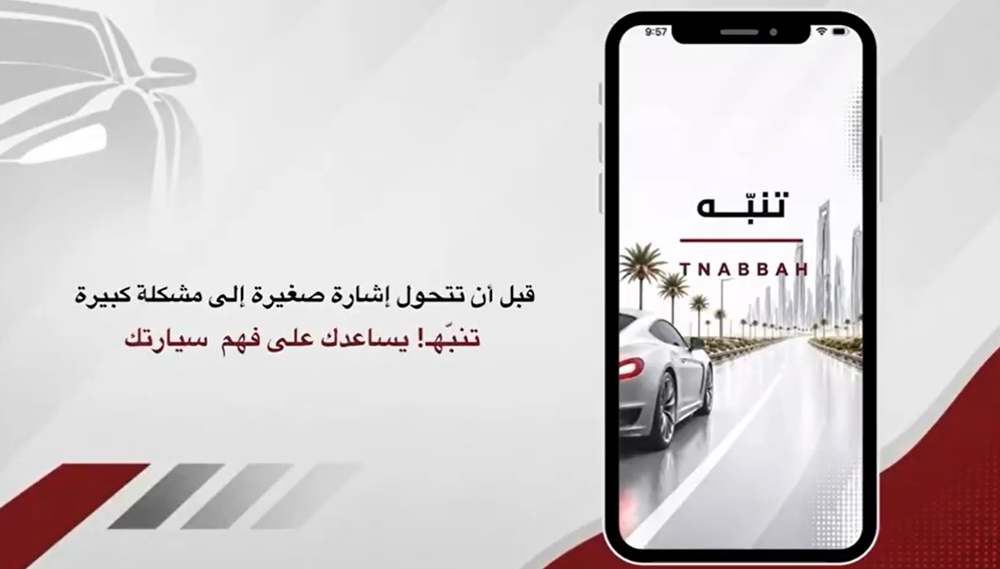

<div align="center">


# TNABBAH (تنبَّه)

### AI-Powered Vehicle Diagnostics Platform

Helping drivers understand their vehicles through real-time diagnostics, intelligent analysis, and actionable insights.

<p>
  <a href="https://youtu.be/310Nld7MZgo">🎥 Watch Demo</a>
</p>

</div>

---

## Demonstration

<div align="center">
<a href="https://youtu.be/310Nld7MZgo">
  
</a>

**Click the image above to watch the full demonstration**
</div>

---

## Overview

TNABBAH is a smart vehicle diagnostics platform that combines OBD-II communication, cloud services, and artificial intelligence to simplify vehicle diagnostics for everyday drivers.

The platform collects live vehicle data, detects fault codes, analyzes vehicle health, and provides user-friendly reports and recommendations through an intelligent automotive assistant.

---

## Key Features

- Real-time vehicle monitoring
- OBD-II diagnostics and fault detection
- AI-powered vehicle health analysis
- Intelligent automotive assistant
- Arabic and English reports
- Maintenance reminders
- Multi-vehicle management
- MQTT real-time communication
- Cloud synchronization with Supabase

---

## Technology Stack

- React Native (Expo)
- FastAPI
- Node.js
- MQTT (Mosquitto)
- Supabase
- DeepSeek AI
- OpenAI SDK
- Contabo VPS

---

## System Architecture

```text
Vehicle
   ↓
OBD-II Adapter
   ↓
Mobile Application
   ↓
MQTT Infrastructure
   ↓
Diagnostics Engine
   ↓
AI Analysis Layer
   ↓
Supabase Cloud Services
