<div align="center">



<br />


# TNABBAH — تنبَّه


**AI-Powered Vehicle Diagnostics & Intelligent Assistance Platform**

Transforming complex vehicle diagnostics into clear, actionable insights for everyday drivers.

<br />

<a href="https://youtu.be/310Nld7MZgo">
  
</a>

<br /><br />


</div>

---

## Project Demonstration

<div align="center">

<a href="https://youtu.be/310Nld7MZgo">
  
</a>

<br />

**Click the image above to watch the full demonstration**

</div>

---

## About TNABBAH

**TNABBAH** is a smart vehicle diagnostics platform that combines **OBD-II Bluetooth communication**, real-time monitoring, cloud infrastructure, and artificial intelligence to make vehicle diagnostics easier for everyday drivers.

The platform reads live vehicle data, detects fault codes, analyzes vehicle health, and turns technical automotive information into clear reports and recommendations through an intelligent automotive assistant.

Instead of showing drivers raw codes only, TNABBAH explains what the issue means, why it matters, and what action can be taken next.

---

## Key Features

| Feature | Description |
|---|---|
| **Real-Time Monitoring** | Reads live vehicle data and displays important metrics in the mobile app. |
| **OBD-II Bluetooth Communication** | Connects to the vehicle through an ELM327 BLE OBD-II adapter. |
| **Fault Code Detection** | Reads Diagnostic Trouble Codes and organizes them for analysis. |
| **AI Vehicle Health Analysis** | Converts technical diagnostics into understandable insights. |
| **Intelligent Assistant** | Helps drivers ask questions and understand their vehicle condition. |
| **Arabic & English Reports** | Generates simplified reports in both languages. |
| **Maintenance Reminders** | Supports proactive maintenance tracking and reminders. |
| **Multi-Vehicle Management** | Allows users to manage and monitor more than one vehicle. |
| **MQTT Live Telemetry** | Sends real-time vehicle readings through MQTT infrastructure. |
| **Cloud Synchronization** | Stores and synchronizes user, vehicle, and report data using Supabase. |

---

## System Architecture

```text
Vehicle
   │
   ▼
OBD-II Bluetooth Adapter
   │
   ▼
TNABBAH Mobile Application
   │
   ▼
MQTT Infrastructure
   │
   ▼
Diagnostics Engine
   │
   ▼
AI Analysis Layer
   │
   ▼
Supabase Cloud Services
```

---

## Technology Stack

### Mobile Application

- React Native
- Expo
- TypeScript

### Backend Services

- FastAPI
- Node.js
- Python

### Cloud & Infrastructure

- Supabase
- MQTT Mosquitto
- Contabo VPS

### Artificial Intelligence

- DeepSeek AI
- OpenAI SDK

### Vehicle Communication

- OBD-II
- ELM327 BLE Adapter

---

## Project Objectives

- Simplify vehicle diagnostics for everyday drivers
- Detect vehicle issues before they become critical
- Transform technical automotive data into understandable insights
- Support proactive maintenance decisions
- Improve driver awareness through AI-powered assistance
- Connect real-time vehicle telemetry with cloud-based AI analysis

---

## What Makes TNABBAH Different?

TNABBAH brings **real-time diagnostics**, **AI analysis**, **conversational assistance**, **maintenance tracking**, and **cloud connectivity** together in one platform.

Most diagnostic tools show technical codes that are difficult for non-specialists to understand. TNABBAH focuses on the driver experience by translating fault codes and live readings into clear, practical, and meaningful guidance.

---

## Repository Scope

This repository showcases the public version of the TNABBAH graduation project.

Some sensitive or private implementation details may be excluded from the public repository, such as environment variables, API keys, server credentials, private datasets, and production configuration files.

---

## Built With Purpose

TNABBAH was built to make vehicle diagnostics:

- **Smarter** through AI analysis
- **Clearer** through simplified explanations
- **Faster** through real-time monitoring
- **More accessible** for everyday drivers

---

<div align="center">



</div>


-------------------------------------

-------------------------------------

<div align="center">

<table>
<tr>
<td align="center" bgcolor="#F2F2F2">

<br>


# TNABBAH (تنبَّه)


<br>

**AI-Powered Vehicle Diagnostics & Intelligent Assistance Platform**

Transforming complex vehicle diagnostics into clear, actionable insights for everyday drivers.

<br><br>

<a href="https://youtu.be/310Nld7MZgo">
  
</a>

<br><br>


<br><br>

</td>
</tr>
</table>

</div>

---

## Project Demonstration

<div align="center">

<a href="https://youtu.be/310Nld7MZgo">
  
</a>

<br>

**Click the image above to watch the full demonstration**

</div>

---

## About TNABBAH

TNABBAH is a smart vehicle diagnostics platform that combines OBD-II communication, cloud infrastructure, and artificial intelligence to make vehicle diagnostics easier for everyday drivers.

It reads live vehicle data, detects fault codes, analyzes vehicle health, and turns technical information into clear reports and recommendations through an intelligent automotive assistant.

---

## Key Features

- Real-time vehicle monitoring
- Live OBD-II sensor readings
- Diagnostic Trouble Code detection
- AI-powered vehicle health analysis
- Intelligent automotive assistant
- Arabic and English reports
- Maintenance reminders and tracking
- Multi-vehicle management
- MQTT-based real-time communication
- Cloud synchronization with Supabase

---

## System Architecture

```text
Vehicle
   │
   ▼
OBD-II Adapter
   │
   ▼
TNABBAH Mobile Application
   │
   ▼
MQTT Infrastructure
   │
   ▼
Diagnostics Engine
   │
   ▼
AI Analysis Layer
   │
   ▼
Supabase Cloud Services
```

---

## Technology Stack

### Mobile Application
- React Native
- Expo
- TypeScript

### Backend Services
- FastAPI
- Node.js
- Python

### Cloud & Infrastructure
- Supabase
- MQTT Mosquitto
- Contabo VPS

### Artificial Intelligence
- DeepSeek AI
- OpenAI SDK

### Vehicle Communication
- OBD-II
- ELM327 BLE Adapter

---

## Project Objectives

- Simplify vehicle diagnostics for everyday drivers
- Detect vehicle issues before they become critical
- Transform technical automotive data into understandable insights
- Support proactive maintenance decisions
- Improve driver awareness through AI-powered assistance

---

## What Makes TNABBAH Different?

TNABBAH brings real-time diagnostics, AI analysis, conversational assistance, maintenance tracking, and cloud connectivity together in one platform.

Instead of showing drivers raw fault codes and technical readings, TNABBAH explains what matters, why it matters, and what action can be taken next.

---

<div align="center">

<table>
<tr>
<td align="center" bgcolor="#F2F2F2">

<br>

## TNABBAH was built to make vehicle diagnostics smarter, clearer, and closer to every driver.

### From live data to meaningful decisions.

**خلك دائمًا مُنتبِه**

<br>

Built as a Software Engineering Graduation Project.

<br><br>

</td>
</tr>
</table>

</div>
